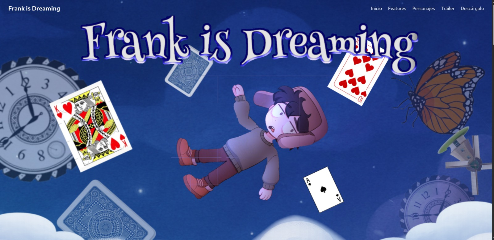
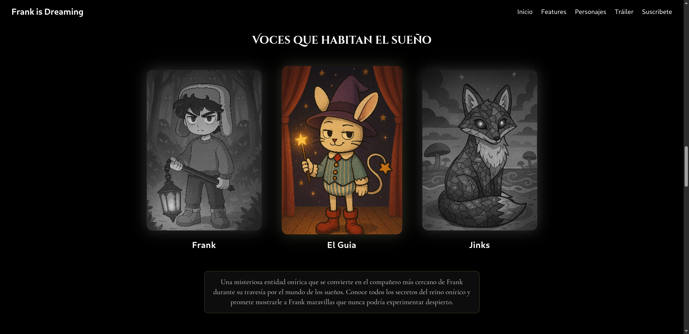
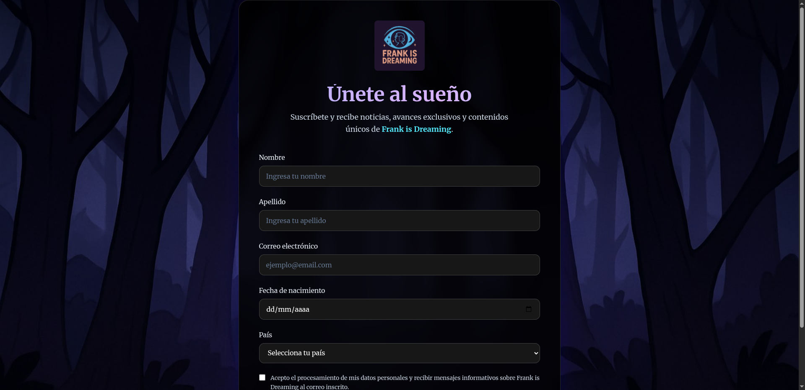

# 🌙 Frank Is Dreaming

> **Un metroidvania onírico y melancólico** donde los sueños se convierten en prisiones, y el verdadero terror es no poder despertar.  


---

## 📖 Información General

- 🎮 **Nombre del Proyecto:** Frank Is Dreaming  
- 🧩 **Género:** Metroidvania + Terror Psicológico  
- 💻 **Plataforma Principal:** PC  
- ⚙️ **Motor:** Unity  
- 💾 **Lenguaje:** C#  
- 👤 **Desarrollador:** Proyecto en solitario  

---

## 🌌 Concepto Central  

**Premisa**  
Frank Is Dreaming explora el miedo a los **sueños lúcidos** y la sensación de estar atrapado en una realidad que se derrumba.  
El jugador viaja a través de paisajes imposibles, llenos de símbolos emocionales, donde los **miedos toman forma física** y cada paso lo acerca más a la verdad:  
¿Está soñando… o acaso nunca estuvo despierto?  

**Características clave:**  
- 🎭 Narrativa psicológica y simbólica.  
- 🕯️ Mundo onírico con atmósfera melancólica y surrealista.  
- 🌀 Jugabilidad estilo *Metroidvania* con exploración y backtracking.  
- 💡 Mecánicas ligadas al estado de vigilia y sueño profundo.  

---

## 🛠️ Tecnologías Usadas  


---

## 🖼️ Vista Previa del Sitio Web  

Esto es solo una parte de la página web en construcción:  

  
  
  

---

## 🚀 Instalación y Uso  

Clona el repositorio y ejecuta el proyecto localmente:  

```bash
git clone https://github.com/L2342/FrakIsDreamingWeb.git
cd FrakIsDreamingWeb
cd web/
npm install
npm run dev
