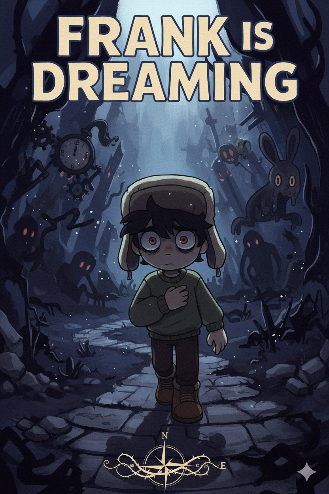

# 🎮 FrankIsDreamingWeb
Pagina web proyecto Programación web





## Preview
*(Agregaremos capturas una vez tengamos el diseño terminado)*  


### Clona el repositorio:
```bash
git clone https://github.com/L2342/FrakIsDreamingWeb.git
cd frank-is-dreaming
